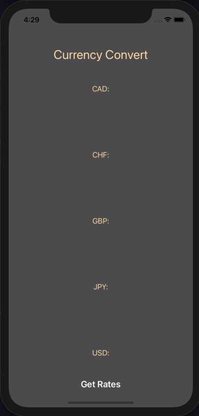

<h1 align="left">
    Get Api Currency
</h1>

<h4 align="left">
  Application that obtains currency values ​​in real time from api.
</h4>

<p align="left">

  
  <a href="https://www.codacy.com/manual/ewersoncastelo/Get_Api_Currency?utm_source=github.com&amp;utm_medium=referral&amp;utm_content=ewersoncastelo/Get_Api_Currency&amp;utm_campaign=Badge_Grade"></a>
<a href="https://github.com/ewersoncastelo/Get_Api_Currency/issues">
    
  </a>
    
  <a href="https://github.com/ewersoncastelo/Get_Api_Currency/commits/master">
    
  </a>
</p>

## Preview



## Features

-   UIkit
-   SnapKit
-   URLSession
-   UIAlertController
-   JSONSerialization
-   UIStackView

## How To Use

To clone and run this application, you'll need [Git](https://git-scm.com), and last version XCODE IDE 10 higher installed on your computer. From your command line:

```bash
# Clone this repository
$ git clone https://github.com/ewersoncastelo/Get_Api_Currency

# Go into the repository
$ cd Get_Api_Currency

# Install dependencies
$ pod install

# Run the app in the simulator
$ open -a xcode
```

## :memo: License
This project is under the MIT license. See the [LICENSE](https://github.com/ewersoncastelo/Get_Api_Currency/blob/master/LICENSE) for more information.

---

[vc]: https://developer.apple.com/documentation/xcode_release_notes/xcode_11_release_notes
